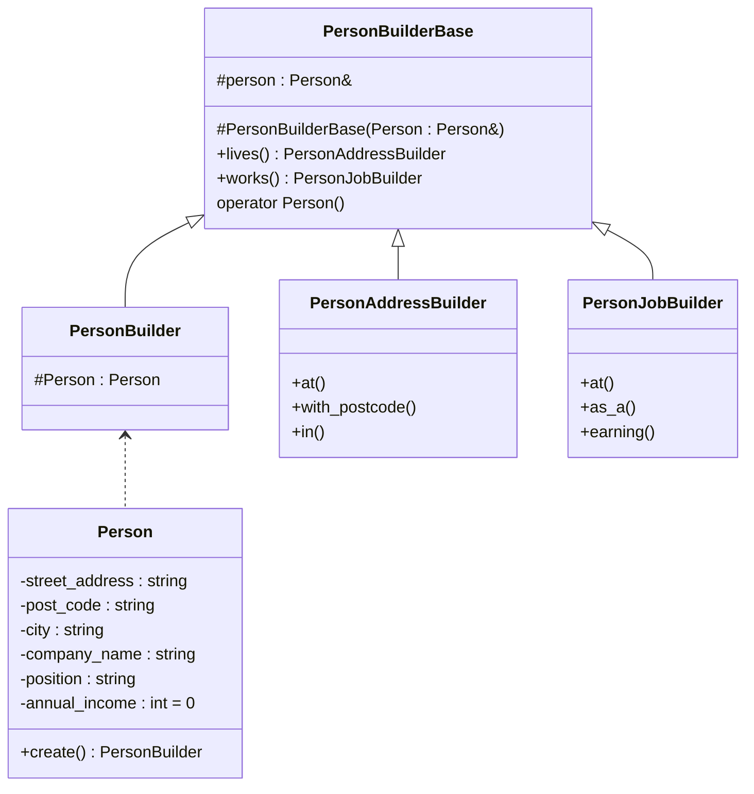

# 构造器模式

构造器（builder）模式主要关注复杂对象的创建过程，复杂对象指的是难以通过单一构造函数来创建的对象。这类对象本身可能由其他对象组成，并且可能涉及不太明显的逻辑，因此需要专门设计单独的组件来创建。

## 预想方案

创建一个网页的组件，输出一个简单的无序列表。

```c++
string words[] = {"hello", "world"};
ostringstream oss;
oss << "<ul>";
for(auto w : words)
    oss << " <li>" << w << "</li>";
oss << "</ul>";
printf(oss.str().c_str())；
```

采用OOP的思想定义一个 HtmlElement 类，用于存储每一类标签的信息：

```c++
struct HtmlElement {
    string name, text;
    vector<HtmlElement> elements;
    
    Htmlelement() {}
    Htmlelement(const string& name, const string& text) : name(name), text(text) {}
    string str(int indent = 0) const {
        // 考虑到元素的子元素包含子元素的情况，该方法可以采用递归处理起来会方便点
        // 递归法
        if(elements.empty()) {
            return "<" + name + "> " + text + " </" + name + ">";
        }
        string res;
        res += "<" + name + "> " + text;
        for(auto e : elements) {
            res += e.str();
        }
        res += " </" + name + + ">";
        return res;
    }
};
```

采用这种方法，就可以合理的创建列表：

```c++
string words[] = { "hello", "world" };
HtmlElement list{"ul", ""};
for(auto w : words)
    list.elements.emplace_back("li", w);
printf(list.str().c_str());
```

## 简单构造器

构造器模式将尝试将对象的分段构造过程封装到单独的类中。

```c++
struct HtmlBuilder {
    HtmlElement root;
    HtmlBuilder(string root_name) { root.name = root_name; }
    void add_child(string child_name, string child_text) {
		root.elements.emplace_back(child_name, child_text);
    }
    string str() { return root.str(); }
};
```

使用方法：

```c++
HtmlBuilder builder{"ul"};
builder.add_child("li", "hello");
builder.add_child("li", "world");
cout << builder.str() << endl;
```

此处 `add_child()` 方法返回的是 void。方法的返回值可以由许多用处，其中最常见的就是创建流式接口。

## 流式构造器

修改 `add_child()` 函数的返回值即可。

```c++
HtmlBuilder& add_child(string child_name, string child_text {
	root.elements.emplace_back(child_name, child_text);
    return *this;
}
```

使用方法：

```c++
HtmlBuilder builder{"ul"};
builder.add_child("li", "hello").add_child("li", "world");
cout << builder.str() << endl;
```

使用指针还是引用凭个人爱好，若使用指针如下:

```c++
HtmlBuilder* add_child(string child_name, string child_text) {
    root.elements.emplace_back(child_name, child_text);
    return this;
}
```

使用方法：

```c++
HtmlBuilder* builder = new HtmlBuilder{"ul"};
builder->add_child("li", "hello")->add_child("li", "world");
cout << builder->str() << end;
delete builder;
```

## 向用户传达意图

现在已经有了一个用于创建HTML元素专用的构造器 HTMLBuilder，但是要怎么让用户知道它的使用方法呢？一种办法是，强制用户在构建对象时使用 HTMLBuilder。

代码主要部分如下，完整代码在htmlbuilder文件夹中：

```c++
struct HtmlElement {
    string name;
    string text;
    vector<HtmlElement> elements;
    const size_t indent_size = 2;
    friend HtmlBuilder;

    static unique_ptr<HtmlBuilder> create(const string& root_name) {
        return std::make_unique<HtmlBuilder>(root_name);
    }
    string str(int indent = 0) const {
        // implementation omitted
    }
};
```

但是最终目的是创建一个HtmlElement，而不是它的构造器！所以，锦上添花的做法是，通过定义调用运算符实现隐式转换，从而最终输出的是HtmlElement。

```c++
struct HtmlBuilder {  
    operator HtmlElement() const {
        return root;
    }
    // other operations omitted
};
```

遗憾的是没有一种明确的方法可以告知其他用户要以上面的方式进行调用API，所以希望对构造函数的限制以及静态函数`create()`的存在能够让用户使用构造器。所以可以添加`build()`函数。

```c++
HtmlElement build() const {
	return root;
}
```

## Groovy 风格的构造器

这个例子有点偏离构造器模式的主题，因为在这个实例中实际上看不到构造器的身影。这只是一种备选方法。

借助于C++的初始化列表特性，可以使用普通类高效地构建与HTML兼容的DSL。

```c++
struct Tag {
    string name;
    string text;
    vector<Tag> children;
    vector<pair<string, string>> attributes;

    friend ostream& operator<<(ostream& os, const Tag& tag) {
        os << "name: " << tag.name << " text: " << tag.text << '\n';
        return os;
    }

protected:
    Tag(const string& name, const string& text) : name(name), text(text) {}
    Tag(const string& name, const vector<Tag>& children) : name(name), children(children) {}
};

struct P : Tag {
    explicit P(const string& text) : Tag("P", text) {}

    P(std::initializer_list<Tag> children) : Tag("P", children) {
        std::cout << "test." << '\n';
    }
};

struct IMG : Tag {
    explicit IMG(const string& url) : Tag("IMG", "") {
        attributes.emplace_back("src", url);
    }
};
```

## 组合构造器

假设我们想记录一个人地某些信息：

```c++
class Person {
    // address
    string street_address, post_code, city;
    // employment
    string company_name, position;
    int annual_income = 0;
    
    Person(){}
};
```

如果要用单独的构造器来分别创建不同的信息，需要创建不少于四个不同的类。

首先构建类图：



这比之前定义的构造器复杂多了，讨论一下 PersonBuilderBase 的各个成员：

* person：这是对即将创建的对象的引用。关键点是，在这各类中没有实际存储Person的成员。这个类存储的是Person的引用，而不是实际构造的Person对象。
* 以Person的引用作为参数的构造函数被声明为protected，因此只有派生类可以使用它。
* Operator Person（）是之前使用过的技术，这个函数假设Person提供了一个正确的移动构造函数。
* lives()和works()是两个返回构造构造器的函数：它们分别对地址和工作信息进行构造。

基类中唯一缺少的就是实际要构建的对象。它存储在派生类PersonBuilder中。这个类也是我们要真正使用的类。

PersonBuilder这个类不是用于继承的，它只是一个构建构造器初始化的工具。

详细代码见personbuilder文件夹。

## 参数化构造器

强制客户使用构造器而不是直接使用构造对象的唯一方法是是构造函数不可访问。然而在某些情况下，可能想要明确地强制用户从一开始就与构造器打交道，甚至希望隐藏正在构建对象。

例如，假设有一个用于发送电子邮件的API，其内部电子邮件的描述如下：

```c++
class Email {
public:
    string from, to, subject, body;
    // possibly other members here
};
```

注意“内部”是指——不想让用户直接与这个类打交道，也许是因为这个类中存储了一些关于附加服务的信息。

为了强制客户使用构造器，可以实现一个MailService：

```c++
class MailService {
	class Email{...}; // keep it private
public:
    class EmailBuilder {...};
    
    void send_mail(function<void(EmailBuilder&)> builder) {
        Email email;
        EmailBuilder b{email};
        builder(b);
        send_mail_impl(email);
    }
private:
    void send_mail_impl(const Email& email) {
		// actually send the email
    }
};
```


完整代码见parambuilder。

参数化构造器模式强制用户通过提供的API来使用构造器。采用这种基于函数的技巧能够确保用户获得已初始化的构造器对象。

## 构造器模式的继承

流式接口继承最大的问题就是再调用接口时，能否从基类内部的this指针转换为正确的类型并作为流式接口的返回值。解决这个问题的唯一有效的解决方案是使用一个贯穿整个继承层的模板参数（TSelf）。

完整代码见inherit文件夹。

## 总结

* 构造器模式可以通过流式接口调用链来实现复杂的构建过程，为了实现流式接口，构造器的函数需要返回 this 或 *this。
* 为了强制用户使用构造器的API，可以将目标对象的构造函数限制为不可访问，同时定义一个`create()`接口返回构造器。
* 通过定义适当的元素符，可以使构造器转换为对象本身。
* 借助 C++ 新特性中的同一初始化语法，可以实现 Groovy 风格的构造器。这是一种很通用的方法，可以构建各式各样的DSL。
* 单个构造器接口可以暴露多个子构造器接口。通过灵活地使用继承和流式接口，但很容易将一个接口转换为另一个构造器。

> 注意：当对象的构造过程是非常普通的时候，构造器模式是有意义地。对于那些通过数量有限且明明合理的构造参数来明确的简单对象而言，应该使用构造函数（或依赖注入），而不必使用构造器模式。

